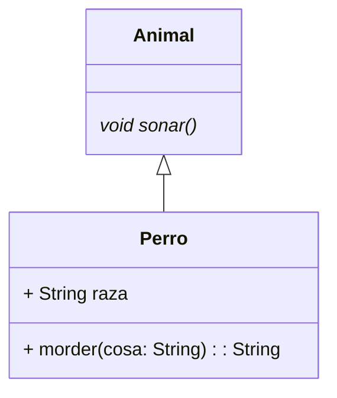

# Diagrama de clases

## Animales

El siguiente diagrama representa la estructura de clases de los tipos de aimales de la aplicacion

```java
class Perro extends Animal {
  String raza;
  String morder(String cosa) {
    return null;
  }
  @Override
  void sonar() {
  }
}

abstract class Animal {
  void alimentar(){
  }
  abstract void sonar();
}
```

