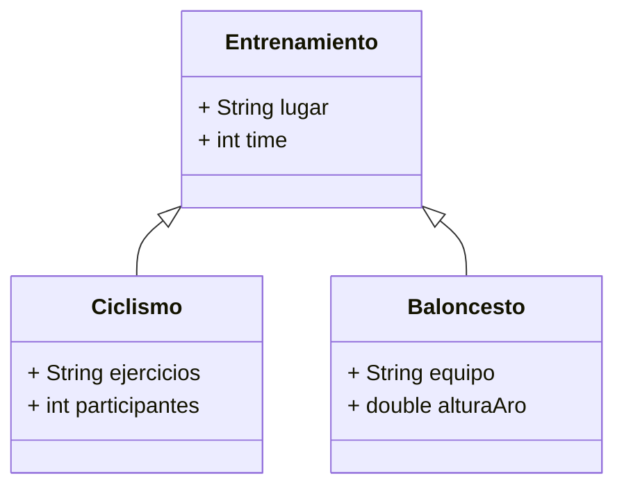

# Diagrama de clases

## Herencia


```mermaid
classDiagram
Entrenamiento <|-- Ciclismo
Entrenamiento <|-- Baloncesto
class Entrenamiento {
    + String lugar
    + int time
}
class Ciclismo {
    + String ejercicios
    + int participantes
}
class Baloncesto {
    + String equipo
    + double alturaAro
}
```

## Realización 

```mermaid
classDiagram

