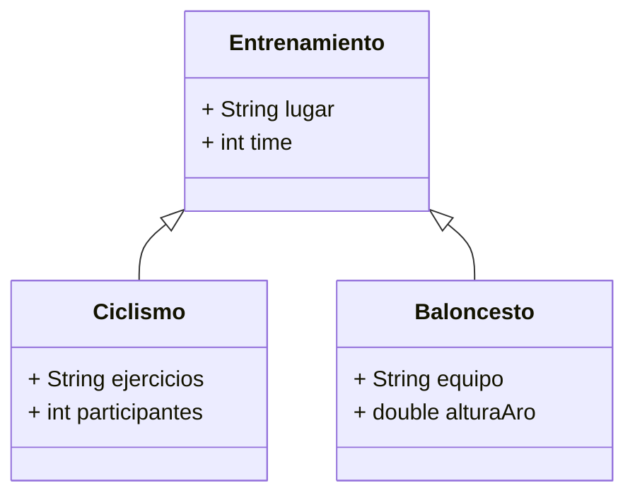

# Diagrama de clases

## Herencia



## Realización 

```mermaid
classDiagram
interface Entrenarmiento {
    +void calentar(time : String): String
    +void entrenar(): String
    +void estirar(): String
}
class Ciclismo implements Entrenamiento {
    + String ejercicios
    + int participantes
}
class Baloncesto implements Entrenamiento {
    + String equipo
    + double alturaAro
}
```

