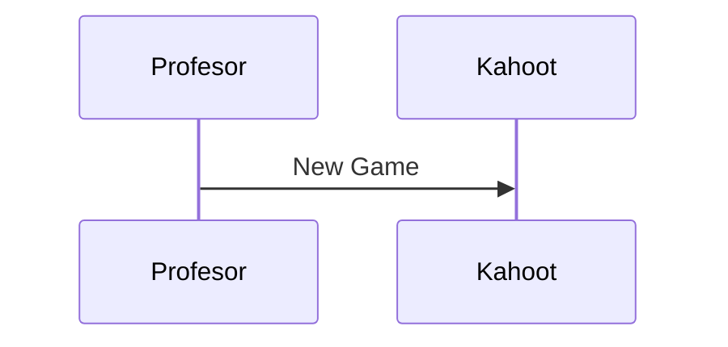
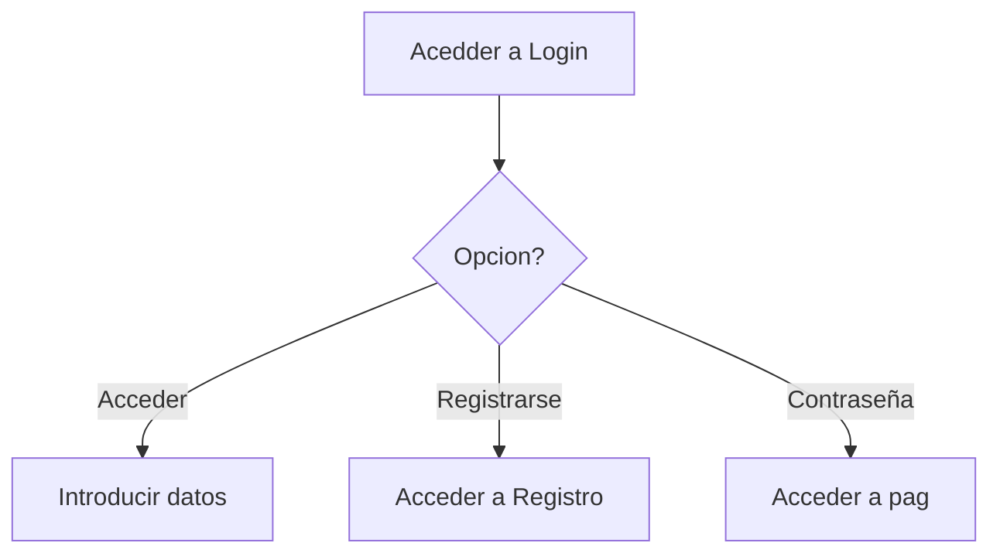

# Diagrama de clases

## Relaciones

### Herencia

 La herencia permite crear clases que reutilizan, extienden y modifican el comportamiento definido en otras clases.

 
### Realización

El concepto de realización refiere la implementación de un interfaz por parte de una clase. Una interfaz es un medio común para que los objetos no relacionados se comuniquen entre sí. Estas son definiciones de métodos y valores sobre los cuales los objetos están de acuerdo para cooperar. 

### Agreagacion

La agregación es un tipo de asociación que indica que una clase es parte de otra clase (composición débil).

### Composicion

La composición significa utlizar objetos dentro de otros objetos.

# Diagrame de secuencia

# Diagrama de actividad

